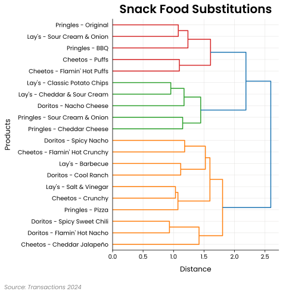

## Plots

### Line Plot

<div class="clear" markdown>

{ align=right loading=lazy width="50%"}

Line plots are particularly good for visualizing sequences that are ordered or sequential, but not necessarily categorical, such as:

- Days since an event (e.g., -2, -1, 0, 1, 2)
- Months since a competitor opened
- Tracking how metrics change across key events

They are often used to compare trends across categories, show the impact of events on performance, and visualize changes over time-like sequences.

Note: While this module can handle datetime values on the x-axis, the **plots.time_line** plot module has additional features that make working with datetimes easier, such as easily resampling the data to alternate time frames.

</div>

Example:

```python
import pandas as pd
from pyretailscience.plots import line

df = pd.DataFrame({
    "months_since_event": range(-5, 6),
    "category A": [10000, 12000, 13000, 15000, 16000, 17000, 18000, 20000, 21000, 20030, 25000],
    "category B": [9000, 10000, 11000, 13000, 14000, 15000, 10000, 7000, 3500, 3000, 2800],
})

line.plot(
    df=df,
    value_col=["category A", "category B"],
    x_label="Months Since Event",
    y_label="Revenue (£)",
    title="Revenue Trends across Categories",
    x_col="months_since_event",
    group_col=None,
    source_text="Source: PyRetailScience - 2024",
    move_legend_outside=True,
)
```

### Histogram Plot
<div class="clear" markdown>

{ align=right loading=lazy width="50%"}

Histograms are particularly useful for visualizing the distribution of data, allowing you to see how values in one or more metrics are spread across different ranges. This module also supports grouping by categories, enabling you to compare the distributions across different groups. When grouping by a category, multiple histograms are generated on the same plot, allowing for easy comparison across categories.

Histograms are commonly used to analyze:

- Sales, revenue or other metric distributions
- Distribution of customer segments (e.g., by age, income)
- Comparing metric distributions across product categories

This module allows you to customize legends, axes, and other visual elements, as well as apply clipping or filtering on the data values to focus on specific ranges.

</div>

Example:

```python
import numpy as np
import matplotlib.pyplot as plt
import pandas as pd

from pyretailscience.plots import histogram

df = pd.DataFrame({
    'first_purchase_revenue': np.concatenate([
        np.random.normal(70, 10, 50000),
        np.random.normal(90, 15, 50000)
    ]),
    'product': ['Product A'] * 50000 + ['Product B'] * 50000
})

histogram.plot(
    df=df,
    value_col='first_purchase_revenue',
    group_col='product',
    title="First Purchase Revenue by Product (£)",
    x_label="Revenue (£)",
    y_label="Number of Customers",
    source_text="Source: PyRetailScience - 2024",
    move_legend_outside=True,
    use_hatch=True
)
```

### Waterfall Plot

<div class="clear" markdown>

{ align=right loading=lazy width="50%"}

Waterfall plots are particularly good for showing how different things add or subtract from a starting number. For
instance,

- Changes in sales figures from one period to another
- Breakdown of profit margins
- Impact of different product categories on overall revenue

They are often used to identify key drivers of financial performance, highlight areas for improvement, and communicate
complex data stories to stakeholders in an intuitive manner.

</div>

Example:

```python
from pyretailscience.standard_graphs import waterfall_plot

labels = ["New", "Continuning", "Churned"]
amounts = [660000, 420000, -382000]

waterfall_plot(
    labels=labels,
    amounts=amounts,
    title="New customer growth hiding churn issue",
    source_text="Source: PyRetailScience - Sales FY2024 vs FY2023",
    display_net_bar=True,
    rot=0,
)
```

### Index Plots

<div class="clear" markdown>

{ align=right loading=lazy width="50%"}

Index plots are visual tools used in retail analytics to compare different categories or segments against a baseline or
average value, typically set at 100. Index plots allow analysts to:

Quickly identify which categories over- or underperform relative to the average
Compare performance across diverse categories on a standardized scale
Highlight areas of opportunity or concern in retail operations
Easily communicate relative performance to stakeholders without revealing sensitive absolute numbers

In retail contexts, index plots are valuable for:

Comparing sales performance across product categories
Analyzing customer segment behavior against the overall average
Evaluating store or regional performance relative to company-wide metrics
Identifying high-potential areas for growth or investment

By normalizing data to an index, these plots facilitate meaningful comparisons and help focus attention on significant
deviations from expected performance, supporting more informed decision-making in retail strategy and operations.

</div>

Example:

```python
from pyretailscience.standard_graphs import index_plot

index_plot(
    df,
    df_index_filter=df["segment_name"] == "Light",
    value_col="unit_price",
    group_col="category_0_name",
    title="Music an opportunity category for Light?",
    y_label="Categories",
    x_label="Indexed Spend",
    source_text="Source: Transaction data financial year 2023",
    sort_by="value",
    sort_order="descending",
    legend_title="Quarter",
)
```

### Timeline Plot

<div class="clear" markdown>

{ align=right loading=lazy width="50%"}

Timeline plots are a fundamental tool for interpreting transactional data within a temporal context. By presenting data
in a chronological sequence, these visualizations reveal patterns and trends that might otherwise remain hidden in raw
numbers, making them essential for both historical analysis and forward-looking insights. They are particularly useful
for:

- Tracking sales performance across different periods (e.g., daily, weekly, monthly)
- Identifying seasonal patterns or promotional impacts on sales
- Comparing the performance of different product categories or store locations over time
- Visualizing customer behavior trends, such as purchase frequency or average transaction value

</div>

Example:

```python
import numpy as np
import pandas as pd

from pyretailscience.standard_graphs import time_plot

# Create a sample DataFrame with 3 groups
rng = np.random.default_rng(42)
df = pd.DataFrame(
    {
        "transaction_datetime": pd.concat(
            [pd.Series(pd.date_range(start="2022-01-01", periods=200, freq="D"))] * 3
        ),
        "total_price": np.concatenate(
            [rng.integers(1, 1000, size=200) * multiplier for multiplier in range(1, 4)]
        ),
        "group": ["Group A"] * 200 + ["Group B"] * 200 + ["Group C"] * 200,
    },
)

time_plot(
    df,
    period="M",
    group_col="group",
    value_col="total_price",
    agg_func="sum",
    title="Monthly Sales by Customer Group",
    y_label="Sales",
    legend_title="Customer Group",
    source_text="Source: PyRetailScience - Sales FY2024",
    move_legend_outside=True,
)
```

## Analysis Modules

### Product Association Rules

The product association module implements functionality for generating product association rules, a powerful technique
in retail analytics and market basket analysis.

Product association rules are used to uncover relationships between different products that customers tend to purchase
together. These rules provide valuable insights into consumer behavior and purchasing patterns, which can be leveraged
by retail businesses in various ways:

1. Cross-selling and upselling: By identifying products frequently bought together, retailers can make targeted product
   recommendations to increase sales and average order value.

2. Store layout optimization: Understanding product associations helps in strategic product placement within stores,
   potentially increasing impulse purchases and overall sales.

3. Inventory management: Knowing which products are often bought together aids in maintaining appropriate stock levels
   and predicting demand.

4. Marketing and promotions: Association rules can guide the creation ofeffective bundle offers and promotional
   campaigns.

5. Customer segmentation: Patterns in product associations can reveal distinct customer segments with specific
   preferences.

6. New product development: Insights from association rules can inform decisions about new product lines or features.

The module uses metrics such as support, confidence, and uplift to quantifythe strength and significance of product
associations:

- Support: The frequency of items appearing together in transactions.
- Confidence: The likelihood of buying one product given the purchase of another.
- Uplift: The increase in purchase probability of one product when another is bought.

Example:

```python
from pyretailscience.product_association import ProductAssociation

pa = ProductAssociation(
    df,
    value_col="product_name",
    group_col="transaction_id",
)
pa.df.head()
```
<!-- markdownlint-disable MD013 -->
| product_name_1   | product_name_2               |  occurrences_1 |  occurrences_2 |  cooccurrences |  support | confidence | uplift |
|:-----------------|:-----------------------------|---------------:|---------------:|---------------:|---------:|-----------:|-------:|
| 100 Animals Book | 100% Organic Cold-Pressed... |             78 |             78 |              1 | 0.000039 |  0.0128205 |   4.18 |
| 100 Animals Book | 20K Sousaphone               |             78 |             81 |              3 | 0.000117 |  0.0384615 |  12.10 |
| 100 Animals Book | 360 Sport 2.0 Boxer Briefs   |             78 |             79 |              1 | 0.000039 |  0.0128205 |   4.13 |
| 100 Animals Book | 4-Series 4K UHD              |             78 |             82 |              1 | 0.000039 |  0.0128205 |   3.98 |
| 100 Animals Book | 700S Eterna Trumpet          |             78 |             71 |              1 | 0.000039 |  0.0128205 |   4.60 |
<!-- markdownlint-enable MD013 -->

### Cross Shop

<div class="clear" markdown>

{ align=right loading=lazy width="50%"}

PASTE TEXT HERE

</div>

Example:

```python
PASTE CODE HERE
```

### Gain Loss

<div class="clear" markdown>

{ align=right loading=lazy width="50%"}

PASTE TEXT HERE

</div>

Example:

```python
PASTE CODE HERE
```

### Customer Decision Hierarchy

<div class="clear" markdown>

{ align=right loading=lazy width="50%"}

A Customer Decision Hierarchy (CDH), also known as a Customer Decision Tree, is a powerful tool in retail analytics that
 visually represents the sequential steps and criteria customers use when making purchase decisions within a specific
 product category. Here's a brief summary of its purpose and utility:

CDHs allow analysts to:

- Map out the hierarchical structure of customer decision-making processes
- Identify key product attributes that drive purchase decisions
- Understand product substitutions and alternatives customers consider
- Prioritize product attributes based on their importance to customers

In retail contexts, CDHs are valuable for:

- Optimizing product assortments and shelf layouts
- Developing targeted marketing strategies
- Identifying opportunities for new product development
- Understanding competitive dynamics within a category

By visualizing the decision-making process, CDHs help retailers align their offerings and strategies with customer
preferences, potentially increasing sales and customer satisfaction. They provide insights into how customers navigate
choices, enabling more effective category management and merchandising decisions.

</div>

Example:

```python
from pyretailscience.range_planning import CustomerDecisionHierarchy

cdh = CustomerDecisionHierarchy(df)
ax = cdh.plot(
    orientation="right",
    source_text="Source: Transactions 2024",
    title="Snack Food Substitutions",
)
```

### Revenue Tree

<div class="clear" markdown>

{ align=right loading=lazy width="50%"}

PASTE TEXT HERE

</div>

Example:

```python
PASTE CODE HERE
```

### HML Segmentation

<div class="clear" markdown>

{ align=right loading=lazy width="50%"}

PASTE TEXT HERE

</div>

Example:

```python
PASTE CODE HERE
```

### Threshold Segmentation

<div class="clear" markdown>

{ align=right loading=lazy width="50%"}

PASTE TEXT HERE

</div>

Example:

```python
PASTE CODE HERE
```

### Segmentation Stats

<div class="clear" markdown>

{ align=right loading=lazy width="50%"}

PASTE TEXT HERE

</div>

Example:

```python
PASTE CODE HERE
```

### Purchases Per Customer

<div class="clear" markdown>

{ align=right loading=lazy width="50%"}

PASTE TEXT HERE

</div>

Example:

```python
PASTE CODE HERE
```

### Days Between Purchases

<div class="clear" markdown>

{ align=right loading=lazy width="50%"}

PASTE TEXT HERE

</div>

Example:

```python
PASTE CODE HERE
```

### Transaction Churn

<div class="clear" markdown>

{ align=right loading=lazy width="50%"}

PASTE TEXT HERE

</div>

Example:

```python
PASTE CODE HERE
```
