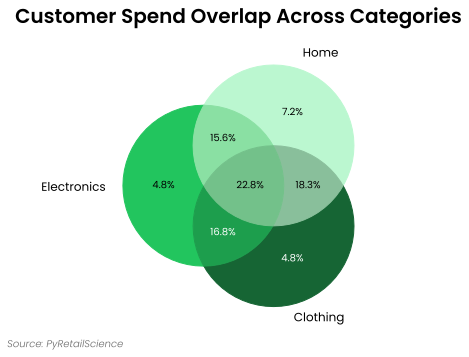
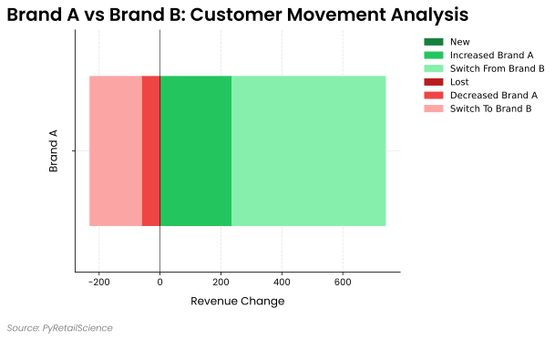
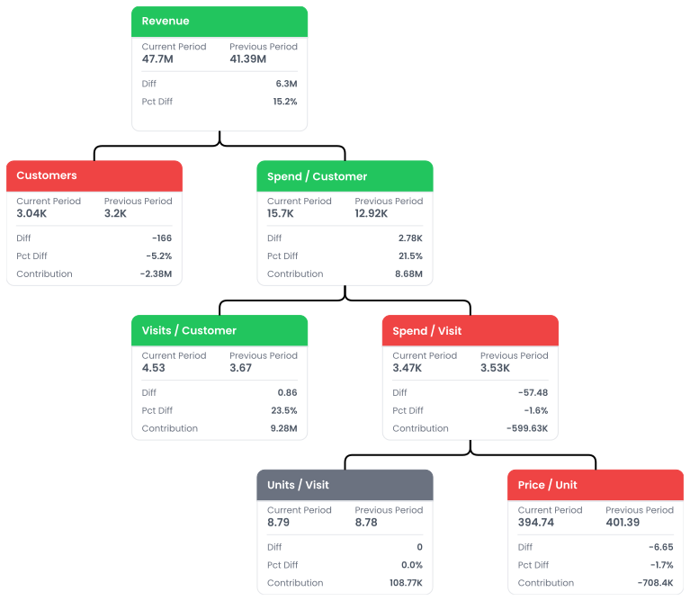
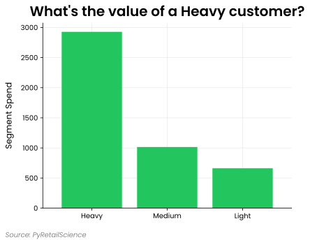
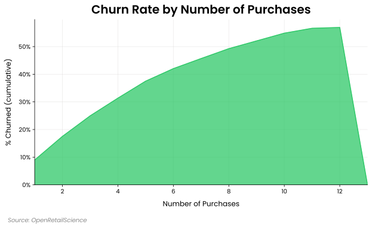

## Analysis Modules

### Cohort Analysis

The cohort analysis module provides functionality for analyzing customer retention patterns over time. It helps
businesses understand customer behavior by tracking groups of users (cohorts) based on their first interaction and
observing their activity over subsequent periods.

Cohort analysis is useful in multiple business applications:

1. **Customer Retention Analysis**: Identifies how long users stay engaged with a product or service.
2. **Churn Rate Measurement**: Helps determine at which stage customers tend to drop off.
3. **Marketing Performance Evaluation**: Measures the long-term impact of marketing campaigns.
4. **Revenue Analysis**: Tracks spending behavior over time to optimize pricing strategies.
5. **User Engagement Trends**: Understands how different user segments behave based on their joining time.

This module calculates cohort tables using various aggregation functions such as `nunique`, `sum`, and `mean`, allowing
flexible analysis of customer data.

The following key metrics are used in the analysis:

- **Aggregation Column**: Defines the metric to track (e.g., unique customers, total spend).
- **Aggregation Function**: Determines how values are aggregated (e.g., sum, mean, count).
- **Cohort Period**: Defines the period granularity (year, quarter, month, week, or day).
- **Retention Percentage**: Calculates retention rates as a percentage of the first-period cohort.

Example:

```python
import pandas as pd
import datetime
from openretailscience.analysis.cohort import CohortAnalysis

data = {
    "transaction_id": [0, 1, 2, 3, 4, 5, 6, 7, 8, 9, 10, 11],
    "customer_id": [1, 2, 3, 1, 2, 3, 1, 2, 3, 4, 5, 4],
    "transaction_date": [
        datetime.date(2023, 1, 15),
        datetime.date(2023, 1, 20),
        datetime.date(2023, 2, 5),
        datetime.date(2023, 2, 10),
        datetime.date(2023, 3, 1),
        datetime.date(2023, 3, 15),
        datetime.date(2023, 3, 20),
        datetime.date(2023, 4, 10),
        datetime.date(2023, 4, 25),
        datetime.date(2023, 5, 5),
        datetime.date(2023, 5, 20),
        datetime.date(2023, 6, 10),
    ],
    "unit_spend": [100, 150, 200, 120, 160, 210, 130, 170, 220, 140, 180, 230]
}
df = pd.DataFrame(data)

cohort = CohortAnalysis(
    df=df,
    aggregation_column="unit_spend",
    agg_func="sum",
    period="month",
    percentage=True,
)
cohort.df.head()
```

| min_period_shopped |    0 |    1 |    2 |    3 |
|:-------------------|-----:|-----:|-----:|-----:|
| 2023-01-01         | 1.00 | 1.00 | 1.00 | 1.00 |
| 2023-02-01         | 0.80 | 1.75 | 0.76 | 0.00 |
| 2023-03-01         | 0.00 | 0.00 | 0.00 | 0.00 |
| 2023-04-01         | 0.00 | 0.00 | 0.00 | 0.00 |
| 2023-05-01         | 1.28 | 1.92 | 0.00 | 0.00 |

### Product Association Rules

The product association module implements functionality for generating product association rules, a powerful technique
in retail analytics and market basket analysis.

Product Association Analysis (Market Basket Analysis) uncovers hidden relationships in customer purchasing behavior,
transforming how retailers approach merchandising, marketing, and operations by revealing which products naturally
sell together.

**Business Problem:**

Retailers lose revenue from missed cross-selling opportunities and poor product placement. Without understanding
product associations, stores might place complementary items in different aisles, miss bundling opportunities,
or stock out on associated items when promoting a product.

**Real-World Applications:**

- **Strategic Merchandising**: Place chips near beer when data shows strong association
- **Dynamic Bundle Pricing**: Create "Breakfast bundle" (Coffee + Pastry) when uplift shows synergy
- **Personalized Recommendations**: Power "Customers who bought X also bought Y" suggestions
- **Inventory Optimization**: Stock pasta sauce when pasta is promoted if association exists
- **New Product Placement**: Position private label next to associated national brands

**Key Metrics Explained:**

- **Support**: Proportion of transactions containing both products (frequency indicator)
- **Confidence**: Probability of buying B given A was purchased (predictive power)
- **Uplift/Lift**: How much more likely products are bought together than by chance
    - Uplift > 1: Positive association (sell better together)
    - Uplift = 1: Independent (no relationship)
    - Uplift < 1: Negative association (rarely bought together)

Example:

```python
from openretailscience.analysis.product_association import ProductAssociation

pa = ProductAssociation(
    df,
    value_col="product_name",
    group_col="transaction_id",
)
pa.df.head()
```
<!-- markdownlint-disable MD013 -->
| product_name_1   | product_name_2               |  occurrences_1 |  occurrences_2 |  cooccurrences |  support | confidence | uplift |
|:-----------------|:-----------------------------|---------------:|---------------:|---------------:|---------:|-----------:|-------:|
| 100 Animals Book | 100% Organic Cold-Pressed... |             78 |             78 |              1 | 0.000039 |  0.0128205 |   4.18 |
| 100 Animals Book | 20K Sousaphone               |             78 |             81 |              3 | 0.000117 |  0.0384615 |  12.10 |
| 100 Animals Book | 360 Sport 2.0 Boxer Briefs   |             78 |             79 |              1 | 0.000039 |  0.0128205 |   4.13 |
| 100 Animals Book | 4-Series 4K UHD              |             78 |             82 |              1 | 0.000039 |  0.0128205 |   3.98 |
| 100 Animals Book | 700S Eterna Trumpet          |             78 |             71 |              1 | 0.000039 |  0.0128205 |   4.60 |
<!-- markdownlint-enable MD013 -->

### Cross Shop

<div class="clear" markdown>

{ align=right loading=lazy width="50%"}

Cross Shop analysis reveals how customers navigate between different categories, brands, or store locations,
replacing assumptions with data-driven insights about actual purchase patterns. The Venn diagram visualization
immediately shows which products customers buy together versus separately.

**Business Problem Solved:**

Retailers often make incorrect assumptions about customer behavior. They might place baby products far from beer,
not realizing these categories have high cross-shopping rates. This analysis reveals the truth about customer
purchase patterns.

**Real-World Applications:**

- **Store Layout Optimization**: Place frequently cross-shopped categories near each other to reduce friction
- **Promotional Strategy**: Bundle products from highly cross-shopped categories for better lift
- **Category Management**: Understand interdependencies and identify opportunity categories
- **Multi-Channel Strategy**: Analyze cross-shopping between online and physical stores
- **Competitive Analysis**: Understand customer loyalty across competing brands

</div>

Example:

```python
import pandas as pd
from openretailscience.analysis import cross_shop

data = {
    "customer_id": [1, 2, 3, 4, 5, 5, 6, 9, 7, 7, 8, 9, 5, 8],
    "category_name" : [
        "Electronics", "Clothing", "Home", "Sports", "Clothing", "Electronics", "Electronics",
        "Clothing", "Home", "Electronics", "Clothing", "Electronics", "Home", "Home"
        ],
    "unit_spend": [100, 200, 300, 400, 200, 500, 100, 200, 300, 350, 400, 500, 250, 360]
}

df = pd.DataFrame(data)

cs_customers = cross_shop.CrossShop(
    df,
    group_1_col="category_name",
    group_1_val="Electronics",
    group_2_val="Clothing",
    group_3_val="Home",
    labels=["Electronics", "Clothing", "Home"],
)

cs_customers.plot(
    title="Customer Spend Overlap Across Categories",
    source_text="Source: OpenRetailScience",
)
```

### Gain Loss

<div class="clear" markdown>

{ align=right loading=lazy width="50%"}

The Gain Loss module (also known as switching analysis) helps analyze changes in customer behavior between two time
periods. It breaks down revenue or customer movement between a focus group and a comparison group by:

- New customers: Customers who didn't purchase in period 1 but did in period 2
- Lost customers: Customers who purchased in period 1 but not in period 2
- Increased/decreased spending: Existing customers who changed their spending level
- Switching: Customers who moved between the focus and comparison groups

This module is particularly valuable for:

- Analyzing promotion cannibalization
- Understanding customer migration between brands or categories
- Evaluating the effectiveness of marketing campaigns
- Quantifying the sources of revenue changes

</div>

Example:

```python
import pandas as pd
import numpy as np
from openretailscience.analysis.gain_loss import GainLoss

np.random.seed(42)
n_customers = 30

df = pd.DataFrame({
    "customer_id": [f"C{i:03d}" for i in range(n_customers)] * 2,
    "unit_spend": np.random.randint(10, 100, size=n_customers * 2),
    "brand": np.random.choice(["Brand A", "Brand B"], size=n_customers * 2),
    "period": ["p1"] * n_customers + ["p2"] * n_customers,
})

gain_loss = GainLoss(
    df=df,
    p1_index= df["period"] == "p1",
    p2_index= df["period"] == "p2",
    focus_group_index=df["brand"] == "Brand A",
    focus_group_name="Brand A",
    comparison_group_index=df["brand"] == "Brand B",
    comparison_group_name="Brand B",
)

gain_loss.plot(
    title="Brand A vs Brand B: Customer Movement Analysis",
    x_label="Revenue Change",
    source_text="Source: OpenRetailScience",
    move_legend_outside=True,
)
```

### Customer Decision Hierarchy

<div class="clear" markdown>

{ align=right loading=lazy width="50%"}

Customer Decision Hierarchy (CDH) analysis reveals how customers perceive products as substitutes or complements,
enabling data-driven range planning decisions. By analyzing actual switching behavior rather than relying on
product attributes or manager intuition, CDH identifies which products customers view as interchangeable versus
essential variety.

**Business Problem Solved:**

Retailers struggle with range rationalization: Which products can be delisted without losing customers? When does
variety add value versus create confusion? CDH answers these questions by examining customer purchase patterns to
identify true substitutability.

**How It Works:**

- Products rarely bought by the same customer → likely substitutes
- Products often bought by the same customer → complements or variety-seeking
- Uses Yule's Q coefficient to measure substitutability strength
- Creates hierarchical clusters showing substitution relationships

**Real-World Applications:**

- **Range Rationalization**: Identify safe delisting candidates within substitute clusters
- **New Product Introduction**: Understand which existing products new items might cannibalize
- **Private Label Strategy**: Identify national brand products suitable for PL alternatives
- **Space Optimization**: Allocate more space to non-substitutable products
- **Markdown Strategy**: Clear substitute products sequentially, not simultaneously

</div>

Example:

```python
from openretailscience.analysis.customer_decision_hierarchy import CustomerDecisionHierarchy

cdh = CustomerDecisionHierarchy(df)
ax = cdh.plot(
    orientation="right",
    source_text="Source: Transactions 2024",
    title="Snack Food Substitutions",
)
```

### Revenue Tree

<div class="clear" markdown>

{ align=right loading=lazy width="50%"}

The Revenue Tree is a hierarchical breakdown of factors contributing to overall revenue, allowing for
detailed analysis of sales performance and identification of areas for improvement.

Key Components of the Revenue Tree:

1. Revenue: The top-level metric, calculated as Customers * Revenue per Customer.

2. Revenue per Customer: Average revenue generated per customer, calculated as:
   Orders per Customer * Average Order Value.

3. Orders per Customer: Average number of orders placed by each customer.

4. Average Order Value: Average monetary value of each order, calculated as:
   Items per Order * Price per Item.

5. Items per Order: Average number of items in each order.

6. Price per Item: Average price of each item sold.

</div>

Example:

```python
import pandas as pd
import numpy as np
from openretailscience.analysis import revenue_tree

np.random.seed(42)

# Generate 100 records
num_records = 100
df = pd.DataFrame({
    "group_id": np.random.choice([1, 2], size=num_records),
    "customer_id": np.random.randint(1, 31, size=num_records),
    "transaction_id": np.arange(1, num_records + 1),
    "unit_spend": np.random.uniform(50, 500, size=num_records).round(2),
    "unit_quantity": np.random.randint(1, 6, size=num_records),
    "transaction_date": pd.to_datetime(
        np.random.choice(pd.date_range("2023-01-01", "2023-01-10"), size=num_records)
    )
})

df["period"] = df["transaction_date"].apply(lambda x: "P1" if x < pd.Timestamp("2023-01-04") else "P2")

rev_tree = revenue_tree.RevenueTree(
    df,
    period_col="period",
    p1_value = "P1",
    p2_value = "P2",
)
```

### HML Segmentation

<div class="clear" markdown>

{ align=right loading=lazy width="50%"}

Heavy, Medium, Light (HML) is a segmentation that places customers into groups based on their percentile of spend or the
number of products they bought. Heavy customers are the top 20% of customers, medium are the next 30%, and light are the
bottom 50% of customers. These values are chosen based on the proportions of the Pareto distribution. Often, purchase
behavior follows this distribution, typified by the expression "20% of your customers generate 80% of your sales."
HML segmentation helps answer questions such as:

- How much more are your best customers worth?
- How much more could you spend acquiring your best customers?
- What is the concentration of sales with your top (heavy) customers?

The module also handles customers with zero spend, with options to include them with light customers, exclude them
entirely, or place them in a separate "Zero" segment.

</div>

Example:

```python
from openretailscience.plots import bar
from openretailscience.segmentation.hml import HMLSegmentation

seg = HMLSegmentation(df, zero_value_customers="include_with_light")

bar.plot(
    seg.df.groupby("segment_name")["unit_spend"].sum(),
    value_col="unit_spend",
    source_text="Source: OpenRetailScience",
    sort_order="descending",
    x_label="",
    y_label="Segment Spend",
    title="What's the value of a Heavy customer?",
    rot=0,
)
```

### Threshold Segmentation

<div class="clear" markdown>

{align=right loading=lazy width="50%"}

Threshold Segmentation offers a flexible approach to customer grouping based on custom-defined percentile thresholds.
Unlike the fixed 20/30/50 split in HML segmentation, Threshold Segmentation allows you to specify your own thresholds
and segment names, making it adaptable to various business needs.

This flexibility enables you to:

- Create quartile segmentations (e.g., top 25%, next 25%, etc.)
- Define custom tiers based on your specific business model
- Segment customers based on alternative metrics beyond spend, such as visit frequency or product variety

Like HML segmentation, the module provides options for handling customers with zero values, allowing you to include
them with the lowest segment, exclude them entirely, or place them in a separate segment.

</div>

Example:

```python
from openretailscience.plots import bar
from openretailscience.segmentation.threshold import ThresholdSegmentation

# Create custom segmentation with quartiles
# Define thresholds at 25%, 50%, 75%, and 100% (quartiles)
thresholds = [0.25, 0.50, 0.75, 1.0]
segments = ["Bronze", "Silver", "Gold", "Platinum"]

seg = ThresholdSegmentation(
    df=df,
    thresholds=thresholds,
    segments=segments,
    zero_value_customers="separate_segment",
)

bar.plot(
    seg.df.groupby("segment_name")["unit_spend"].sum(),
    value_col="unit_spend",
    source_text="Source: OpenRetailScience",
    sort_order="descending",
    x_label="",
    y_label="Segment Spend",
    title="Customer Value by Segment",
    rot=0,
)
```

### Segmentation Stats

<div class="clear" markdown>

The Segmentation Stats module provides functionality to calculate transaction statistics by segment for a particular
segmentation. It makes it easy to compare key metrics across different segments, helping you understand how your
customer (or transactions or promotions) groups differ in terms of spending behavior and transaction patterns.
This module calculates metrics such as total spend, number of transactions, average spend per customer, and transactions
per customer for each segment. It's particularly useful when combined with other segmentation approaches like HML
segmentation.

</div>

Example:

```python
from openretailscience.segmentation.segstats import SegTransactionStats
from openretailscience.segmentation.hml import HMLSegmentation

# First, segment customers using HML segmentation
segmentation = HMLSegmentation(my_table, zero_value_customers="include_with_light")

# Add segment labels to the transaction data using ibis join
table_with_segments = my_table.left_join(
    segmentation.table,
    "customer_id",
)

# Calculate transaction statistics by segment
segment_stats = SegTransactionStats(table_with_segments)

# Display the statistics
segment_stats.df
```
<!-- markdownlint-disable MD013 -->
| segment_name   |    spend |   transactions |   customers |   spend_per_customer |   spend_per_transaction |   transactions_per_customer |   customers_pct |
|:---------------|---------:|---------------:|------------:|---------------------:|------------------------:|----------------------------:|----------------:|
| Heavy          | 2927.21  |             30 |          10 |             292.721  |                97.5735  |                           3 |             0.2 |
| Medium         | 1014.97  |             45 |          15 |              67.6644 |                22.5548  |                           3 |             0.3 |
| Light          |  662.107 |             75 |          25 |              26.4843 |                 8.82809 |                           3 |             0.5 |
| Total          | 4604.28  |            150 |          50 |              92.0856 |                30.6952  |                           3 |             1   |
<!-- markdownlint-enable MD013 -->

### NLR (New-Lapsed-Repeating) Segmentation

<div class="clear" markdown>

NLR segmentation classifies customers into **New**, **Repeating**, and **Lapsed** based on their purchasing activity
across two time periods. Given a baseline period (P1) and a comparison period (P2), customers are assigned:

- **New**: Positive spend in P2 only — acquired in the later period
- **Repeating**: Positive spend in both P1 and P2 — retained customers
- **Lapsed**: Positive spend in P1 only — stopped purchasing

This segmentation helps answer questions such as:

- How effective are your acquisition efforts at bringing in new customers?
- What proportion of your customer base is being retained period-over-period?
- How many customers have lapsed, and what is their value?

The module supports optional group-level segmentation (e.g., by store or category) so you can compare lifecycle
dynamics across different parts of the business.

</div>

Example:

```python
import pandas as pd
from openretailscience.segmentation.nlr import NLRSegmentation

data = pd.DataFrame({
    "customer_id": [1, 1, 2, 2, 3, 4, 4, 5],
    "unit_spend": [50.0, 75.0, 100.0, 120.0, 80.0, 60.0, 90.0, 110.0],
    "period": ["P1", "P2", "P1", "P2", "P1", "P2", "P2", "P2"],
})

seg = NLRSegmentation(
    df=data,
    period_col="period",
    p1_value="P1",
    p2_value="P2",
)

seg.df
```

| customer_id | segment_name | unit_spend_p1 | unit_spend_p2 |
|-------------|--------------|---------------|---------------|
| 1           | Repeating    | 50.0          | 75.0          |
| 2           | Repeating    | 100.0         | 120.0         |
| 3           | Lapsed       | 80.0          | 0.0           |
| 4           | New          | 0.0           | 150.0         |
| 5           | New          | 0.0           | 110.0         |

### RFM Segmentation

<div class="clear" markdown>

**Recency, Frequency, Monetary (RFM) segmentation** categorizes customers based on their purchasing behavior:

- **Recency (R)**: How recently a customer made a purchase
- **Frequency (F)**: How often a customer makes purchases
- **Monetary (M)**: How much a customer spends

Each metric is typically scored on a scale, and the combined RFM score helps businesses identify **loyal customers,
at-risk customers, and high-value buyers**.

RFM segmentation helps answer questions such as:

- Who are your most valuable customers?
- Which customers are at risk of churn?
- Which customers should be targeted for re-engagement?

</div>

Example:

```python
import pandas as pd
from openretailscience.segmentation.rfm import RFMSegmentation

data = pd.DataFrame({
    "customer_id": [1, 1, 2, 2, 3, 3, 3],
    "transaction_id": [101, 102, 201, 202, 301, 302, 303],
    "transaction_date": ["2024-03-01", "2024-03-10", "2024-02-20", "2024-02-25", "2024-01-15", "2024-01-20", "2024-02-05"],
    "unit_spend": [50, 75, 100, 150, 200, 250, 300]
})

data["transaction_date"] = pd.to_datetime(data["transaction_date"])
current_date = "2024-07-01"

rfm_segmenter = RFMSegmentation(df=data, current_date=current_date)
rfm_results = rfm_segmenter.df
```

| customer_id | recency_days | frequency | monetary | r_score | f_score | m_score | rfm_segment | fm_segment |
|-------------|--------------|-----------|----------|---------|---------|---------|-------------|------------|
| 1           | 113          | 2         | 125      | 2       | 0       | 0       | 200         | 0          |
| 2           | 127          | 2         | 250      | 1       | 1       | 1       | 111         | 11         |
| 3           | 147          | 3         | 750      | 0       | 2       | 2       | 22          | 22         |

### Purchases Per Customer

<div class="clear" markdown>

{align=right loading=lazy width="50%"}

The Purchases Per Customer module analyzes and visualizes the distribution of transaction frequency across your customer
base. This module helps you understand customer purchasing patterns by percentile and is useful for determining values
like your churn window.

</div>

Example:

```python
from openretailscience.analysis.customer import PurchasesPerCustomer
from openretailscience.plots import histogram

ppc = PurchasesPerCustomer(transactions)

ax = histogram.plot(
    df=ppc.cust_purchases_s,
    title="Purchases per Customer",
    x_label="Number of purchases",
    y_label="Number of customers",
    source_text="Source: OpenRetailScience",
)
ax.axvline(x=ppc.purchases_percentile(0.8), color="black", linestyle="--", lw=2)
```

### Days Between Purchases

<div class="clear" markdown>

{align=right loading=lazy width="50%"}

The Days Between Purchases module analyzes the time intervals between customer transactions, providing valuable insights
into purchasing frequency and shopping patterns. This analysis helps you understand:

- How frequently your customers typically return to make purchases
- The distribution of purchase intervals across your customer base
- Which customer segments have shorter or longer repurchase cycles
- Where intervention might be needed to prevent customer churn

This information is critical for planning communication frequency, timing promotional campaigns, and developing
effective retention strategies. The module can visualize both standard and cumulative distributions of days between
purchases.

</div>

Example:

```python
from openretailscience.analysis.customer import DaysBetweenPurchases
from openretailscience.plots import histogram

dbp = DaysBetweenPurchases(transactions)

ax = histogram.plot(
    df=dbp.purchase_dist_s,
    bins=15,
    title="Average Days Between Customer Purchases",
    x_label="Average Number of Days Between Purchases",
    y_label="Number of Customers",
)
ax.axvline(x=dbp.purchases_percentile(0.5), color="black", linestyle="--", lw=2)
```

### Transaction Churn

<div class="clear" markdown>

{align=right loading=lazy width="50%"}

The Transaction Churn module analyzes how customer churn rates vary based on the number of purchases customers have
made. This helps reveal critical retention thresholds in the customer lifecycle when setting a churn window

</div>

Example:

```python
from openretailscience.analysis.customer import TransactionChurn
from openretailscience.plots import area

tc = TransactionChurn(transactions, churn_period=churn_period)

cumulative_churn_rate = (
    tc.purchase_dist_df["churned"].cumsum().div(tc.n_unique_customers).to_frame(name="cumulative_churn_rate")
)
area.plot(
    df=cumulative_churn_rate,
    value_col="cumulative_churn_rate",
    title="Churn Rate by Number of Purchases",
    x_label="Number of Purchases",
    y_label="% Churned (cumulative)",
    source_text="Source: OpenRetailScience",
)
```

### Composite Rank

<div class="clear" markdown>

The Composite Rank module enables data-driven multi-factor decision making by combining multiple performance metrics
into a single actionable ranking. This is essential when no single metric tells the complete story - for instance,
a product might have high sales but low margin, or a supplier might offer great prices but poor delivery reliability.

**Real-World Applications:**

- **Product Range Optimization**: Balance sales velocity, margin, stock turn, and ratings for listing decisions
- **Supplier Performance Management**: Evaluate based on price, quality, delivery, and payment terms
- **Store Performance Assessment**: Rank stores using sales per sq ft, conversion rates, labor productivity, and NPS
- **Category Management**: Prioritize categories for space allocation using growth, profitability, and market share

**Group-Based Ranking:**

The module supports both global ranking (across entire dataset) and group-based ranking (within categories):

- **Global Ranking**: Rank all products together regardless of category
- **Group-Based Ranking**: Rank products within each category (electronics vs electronics, apparel vs apparel)
- **Use Cases**: Category management, regional store performance, supplier evaluation by specialization

**Business Value:**

- Removes bias through systematic multi-factor evaluation
- Scales to thousands of products/stores/suppliers simultaneously
- Provides transparent methodology stakeholders can trust
- Enables clear cut-off decisions based on composite performance
- Supports fair comparison within relevant peer groups

**Aggregation Strategies:**

- **Mean**: Balanced scorecard approach, all factors equally important
- **Min**: Conservative approach, focus on worst-performing metric
- **Max**: Optimistic approach, highlight strength in any area
- **Sum**: Cumulative performance across all dimensions

</div>

Example:

```python
import pandas as pd
from openretailscience.analysis.composite_rank import CompositeRank

# Create sample data for products with categories
df = pd.DataFrame({
    "product_id": [1, 2, 3, 4, 5, 6],
    "product_category": ["Electronics", "Electronics", "Electronics", "Apparel", "Apparel", "Apparel"],
    "spend": [100, 150, 75, 200, 125, 80],
    "customers": [20, 30, 15, 40, 25, 18],
    "spend_per_customer": [5.0, 5.0, 5.0, 5.0, 5.0, 4.4],
})

# Create CompositeRank with multiple columns
cr = CompositeRank(
    df=df,
    rank_cols=[
        ("spend", "desc"),           # Higher spend is better
        ("customers", "desc"),       # Higher customer count is better
        ("spend_per_customer", "desc") # Higher spend per customer is better
    ],
    agg_func="mean",     # Use mean to aggregate ranks
    ignore_ties=False,    # Keep ties (rows with same values get same rank)
    group_col="product_category"  # Rank within categories
)

cr.df.sort_values(["product_category", "composite_rank"])
```
<!-- markdownlint-disable MD013 -->
| product_id | product_category | spend | customers | spend_per_customer | spend_rank | customers_rank | spend_per_customer_rank | composite_rank |
|:-----------|-----------------:|------:|----------:|-------------------:|-----------:|---------------:|------------------------:|---------------:|
| 4          | Apparel          | 200   | 40        | 5.0                | 1          | 1              | 1                       | 1.0            |
| 5          | Apparel          | 125   | 25        | 5.0                | 2          | 2              | 1                       | 1.67           |
| 6          | Apparel          | 80    | 18        | 4.4                | 3          | 3              | 3                       | 3.0            |
| 2          | Electronics      | 150   | 30        | 5.0                | 1          | 1              | 1                       | 1.0            |
| 1          | Electronics      | 100   | 20        | 5.0                | 2          | 2              | 1                       | 1.67           |
| 3          | Electronics      | 75    | 15        | 5.0                | 3          | 3              | 1                       | 2.33           |
<!-- markdownlint-enable MD013 -->

## Utils

### Filter and Label by Periods

<div class="clear" markdown>

The Filter and Label by Periods module allows you to:

- Filter transaction data to specific time periods (e.g., quarters, months, promotional periods)
- Add period labels to your data for easy segmentation and comparison
- Analyze before-and-after performance for events or promotions
- Compare metrics across different time frames consistently

This functionality is particularly useful for:

- Comparing KPIs across fiscal quarters or years
- Analyzing seasonal performance patterns
- Measuring the impact of promotions or events
- Creating period-based visualizations with consistent data preparation

</div>

Example:

```python
import pandas as pd
import ibis
from openretailscience.utils.date import filter_and_label_by_periods

# Create a sample transactions table
data = pd.DataFrame({
    "transaction_id": range(1, 101),
    "transaction_date": pd.date_range(start="2023-01-01", periods=100, freq="D"),
    "customer_id": [f"C{i % 20 + 1}" for i in range(100)],
    "amount": [float(i % 5 * 25 + 50) for i in range(100)]
})

transactions = ibis.memtable(data)

# Define period ranges for analysis
period_ranges = {
    "Pre-Promotion": ("2023-01-01", "2023-01-31"),
    "Promotion": ("2023-02-01", "2023-02-28"),
    "Post-Promotion": ("2023-03-01", "2023-03-31")
}

# Filter transactions to the defined periods and add period labels
result_df = filter_and_label_by_periods(transactions, period_ranges).execute()

# Calculate KPIs by period
result_df.groupby("period_name").agg(
    transaction_count=("transaction_id", "count"),
    total_sales=("amount", "sum"),
    avg_transaction_value=("amount", "mean")
)
```

| period_name    | transaction_count | total_sales | avg_transaction_value |
|:---------------|------------------:|------------:|----------------------:|
| Pre-Promotion  |                31 |      3050.0 |                 98.39 |
| Promotion      |                28 |      2800.0 |                100.00 |
| Post-Promotion |                31 |      3150.0 |                101.61 |

### Find Overlapping Periods

<div class="clear" markdown>

The **Find Overlapping Periods** module allows you to:

- Identify overlapping periods between a given start and end date.
- Split the date range into yearly periods that start from the given start date for the first period
  and then yearly thereafter, ending on the provided end date.
- Return results either as ISO-formatted strings (`"YYYY-MM-DD"`) or as `datetime` objects.

This functionality is particularly useful for:

- Analyzing seasonal or yearly patterns in datasets.
- Comparing data across specific date ranges.
- Structuring time-based segmentations efficiently.

</div>

Example:

```python
from datetime import datetime
from openretailscience.utils.date import find_overlapping_periods

# Example with string input
overlapping_periods = find_overlapping_periods("2022-06-15", "2025-03-10")
print(overlapping_periods)
```

| Start Date    | End Date    |
|:--------------|------------:|
| 2022-06-15    | 2023-03-10  |
| 2023-06-15    | 2024-03-10  |
| 2024-06-15    | 2025-03-10  |

### Filter and Label by Condition

<div class="clear" markdown>

The Filter and Label by Condition module allows you to:

- Filter data based on arbitrary conditions (e.g., category, region, price range)
- Add descriptive labels to filtered rows for easier segmentation
- Prepare labeled subsets for downstream analysis or visualization
- Combine multiple Boolean conditions into a single, labeled dataset

This functionality is particularly useful for:

- Segmenting customers or products by custom-defined rules
- Categorizing transactions based on business logic
- Creating labeled training data for machine learning
- Analyzing metrics across different business segments

</div>

Example:

```python
import pandas as pd
import ibis
from openretailscience.utils.filter_and_label import filter_and_label_by_condition

# Sample product table
df = pd.DataFrame({
    "product_id": range(1, 9),
    "category": ["toys", "shoes", "toys", "books", "electronics", "toys", "shoes", "books"],
    "price": [15, 55, 25, 10, 200, 35, 60, 20]
})

products = ibis.memtable(df)

# Define filter conditions
conditions = {
    "Toys": products["category"] == "toys",
    "Shoes": products["category"] == "shoes",
    "Premium Electronics": (products["category"] == "electronics") & (products["price"] > 100)
}

# Apply filtering and labeling
labeled_data = filter_and_label_by_condition(products, conditions).execute()
```

| product_id | category    | price | label               |
|:-----------|------------:|------:|--------------------:|
| 1          | toys        | 15    | Toys                |
| 2          | shoes       | 55    | Shoes               |
| 3          | toys        | 25    | Toys                |
| 5          | electronics | 200   | Premium Electronics |
| 6          | toys        | 35    | Toys                |
| 7          | shoes       | 60    | Shoes               |

### Label by Condition

<div class="clear" markdown>

The **Label by Condition** module provides functionality to label groups (customers, transactions, stores, etc.) based
on whether they contain items that meet specified conditions. This module is designed for group-level analysis where you
want to classify entire entities rather than individual records. Unlike the Filter and Label by Condition function which
filters and labels individual rows of data, this module aggregates data by groups and applies labels at the group level.

The Label by Condition module allows you to:

- Label groups in a table based on whether items in the group meet a specified condition
- Support both binary labeling (contains/not_contains) and extended labeling (contains/mixed/not_contains)
- Customize label names and return column names for flexible analysis
- Analyze group-level patterns for customer segmentation, product categorization, and promotional analysis

This functionality is particularly useful for:

- Tagging transactions as containing a product, product category, or promotion
- Tagging customers as having bought a product, product category, or promotion, or store_id
- Segmenting customers as new, repeating or lapsed

</div>

Example:

```python
import pandas as pd
import ibis
from openretailscience.utils.label import label_by_condition

# Sample transaction data
df = pd.DataFrame({
    "customer_id": [1, 1, 1, 2, 2, 3, 3],
    "product_category": ["toys", "books", "toys", "books", "clothes", "clothes", "clothes"],
})

transactions = ibis.memtable(df)

# Binary labeling: Label customers who bought any toys
toy_customers = label_by_condition(
    table=transactions,
    label_col="customer_id",
    condition=transactions["product_category"] == "toys",
    labeling_strategy="binary"
).execute()
```

| customer_id | label_name   |
|:------------|-------------:|
| 1           | contains     |
| 2           | not_contains |
| 3           | not_contains |
