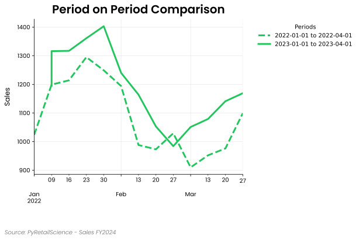
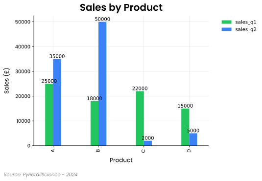

## Plots

### Line Plot

<div class="clear" markdown>

{ align=right loading=lazy width="50%"}

Line plots are particularly good for visualizing sequences that are ordered or sequential, but not necessarily
categorical, such as:

- Days since an event (e.g., -2, -1, 0, 1, 2)
- Months since a competitor opened
- Tracking how metrics change across key events

They are often used to compare trends across categories, show the impact of events on performance, and visualize
changes over time-like sequences.

Note: While this module can handle datetime values on the x-axis, the **plots.time_line** plot module has additional
features that make working with datetimes easier, such as easily resampling the data to alternate time frames.

</div>

Example:

```python
import pandas as pd
from pyretailscience.plots import line

df = pd.DataFrame({
    "months_since_event": range(-5, 6),
    "category A": [10000, 12000, 13000, 15000, 16000, 17000, 18000, 20000, 21000, 20030, 25000],
    "category B": [9000, 10000, 11000, 13000, 14000, 15000, 10000, 7000, 3500, 3000, 2800],
})

line.plot(
    df=df,
    value_col=["category A", "category B"],
    x_label="Months Since Event",
    y_label="Revenue (£)",
    title="Revenue Trends across Categories",
    x_col="months_since_event",
    group_col=None,
    source_text="Source: PyRetailScience - 2024",
    move_legend_outside=True,
)
```

### Period-on-Period Plot



Period-on-period plots help compare the same metric across two or more time intervals,
all aligned to a common starting point. This is useful when you want to:

- Compare different promotional weeks
- Analyze performance across multiple holiday seasons
- Benchmark key metrics across repeated events (e.g., monthly product launches)

Each period is overlaid on the same plot, allowing for easy visual comparison of trends across intervals.

> **Note:** Dates are automatically realigned to a reference start year,
so all lines start at the same x=0 point, regardless of calendar time.

#### Example

```python
import pandas as pd
from pyretailscience.plots.period_on_period import plot

periods = [
    ("2022-01-01", "2022-04-01"),
    ("2023-01-01", "2023-04-01"),
]
data = {
    'date': [
        '2022-01-02', '2022-01-09', '2022-01-16', '2022-01-23', '2022-01-30',
        '2022-02-06', '2022-02-13', '2022-02-20', '2022-02-27', '2022-03-06',
        '2022-03-13', '2022-03-20', '2022-03-27',
        '2023-01-03', '2023-01-08', '2023-01-15', '2023-01-22', '2023-01-29',
        '2023-02-05', '2023-02-12', '2023-02-19', '2023-02-26', '2023-03-05',
        '2023-03-12', '2023-03-19', '2023-03-26',
    ],
    'sales': [
        1024, 1199, 1214, 1295, 1249, 1194, 988, 973, 1029, 910, 952, 976, 1099,
        1195, 1316, 1317, 1361, 1403, 1240, 1164, 1053, 984, 1051, 1079, 1141, 1169,
    ]
}

df = pd.DataFrame(data)

plot(
    df=df,
    x_col="date",
    value_col="sales",
    periods=periods,
    x_label=" ",
    y_label="Sales",
    title="Period on Period Comparison",
    legend_title="Periods",
    source_text="Source: PyRetailScience - Sales FY2024",
    move_legend_outside=True,
)
```

### Area Plot

<div class="clear" markdown>

{ align=right loading=lazy width="50%"}

Area plots are useful for visualizing **cumulative** trends, showing **relative contributions**, and comparing
**multiple data series over time**. They are often used for:

- Visualizing **stacked** contributions (e.g., market share over time)
- Comparing **cumulative** sales or revenue
- Showing **growth trends** across multiple categories

Similar to line plots, **area plots** can display time-series data, but they emphasize the **area under the curve**,
making them ideal for tracking proportions and cumulative metrics.

</div>

Example:

```python
import pandas as pd
import numpy as np
from pyretailscience.plots import area

periods = 6
rng = np.random.default_rng(42)
data = {
    "transaction_date": np.repeat(pd.date_range("2023-01-01", periods=periods, freq="ME"), 3),
    "unit_spend": rng.integers(1, 6, size=3 * periods),
    "category": ["Jeans", "Shoes", "Dresses"] * periods,
}
df = pd.DataFrame(data)
df_pivoted = df.pivot(index="transaction_date", columns="category", values="unit_spend").reset_index()

area.plot(
    df=df_pivoted,
    value_col=["Jeans", "Dresses", "Shoes"],
    x_label="",
    y_label="Sales",
    title="Sales Trends by Product Category",
    x_col="transaction_date",
    source_text="Source: PyRetailScience - 2024",
    move_legend_outside=True,
    alpha=0.5,
)
```

### Scatter Plot

<div class="clear" markdown>

{ align=right loading=lazy width="50%"}

Scatter plots are useful for visualizing **relationships** between two numerical variables, detecting **patterns**, and
identifying **outliers**. They are often used for:

- Exploring **correlations** between variables
- Identifying **clusters** in data
- Spotting **trends** and **outliers**

Scatter plots are particularly useful when analyzing **distributions** and understanding how one variable influences
another. They can also be enhanced with **colors** and **sizes** to represent additional dimensions in the data.

</div>

Example:

```python
import random
import pandas as pd
from pyretailscience.plots import scatter

months = [
    "Jan", "Feb", "Mar", "Apr", "May", "Jun",
    "Jul", "Aug", "Sep", "Oct", "Nov", "Dec"
]
categories = ["Electronics", "Clothing", "Home Decor", "Sports", "Books"]

data = {
    "month": months * len(categories),
    "sales": [random.randint(500, 5000) for _ in range(12 * len(categories))],
    "profit": [random.randint(100, 2000) for _ in range(12 * len(categories))],
    "expenses": [random.randint(300, 4000) for _ in range(12 * len(categories))],
    "category": categories * 12,
}

df = pd.DataFrame(data)

scatter.plot(
    df=df,
    value_col=["sales", "profit", "expenses"],
    x_col="month",
    x_label="",
    y_label="Sales",
    title="Sales, Profit & Expenses Scatter Plot",
    source_text="Source: PyRetailScience - 2024",
    move_legend_outside=True,
    alpha=0.8,
)
```

### Venn Diagram

<div class="clear" markdown>

{ align=right loading=lazy width="50%"}

Venn diagrams are useful for visualizing **overlaps** and **relationships** between multiple categorical sets. They
help in:

- Identifying **commonalities** and **differences** between groups
- Understanding **intersections** between two or three sets
- Highlighting **exclusive and shared** elements

Venn diagrams provide a clear way to analyze how different groups relate to each other. They are often used in market
segmentation, user behavior analysis, and set comparisons.

</div>

Example:

```python
import pandas as pd
from pyretailscience.plots import venn

df =  pd.DataFrame({
    "groups": [(1, 0, 0), (0, 1, 0), (0, 0, 1), (1, 1, 0), (1, 0, 1), (0, 1, 1), (1, 1, 1)],
    "percent": [0.119403, 0.089552, 0.238806, 0.208955, 0.134328, 0.208955, 0.104111]
})
labels = ["Frequent Buyers", "High-Spenders", "Loyal Members"]

venn.plot(
    df,
    labels=labels,
    title="E-commerce Customer Segmentation",
    source_text="Source: PyRetailScience - 2024",
    vary_size=False,
    subset_label_formatter=lambda v: f"{v:.1%}"
)
```

### Histogram Plot

<div class="clear" markdown>

{ align=right loading=lazy width="50%"}

Histograms are particularly useful for visualizing the distribution of data, allowing you to see how values in one or
more metrics are spread across different ranges. This module also supports grouping by categories, enabling you to
compare the distributions across different groups. When grouping by a category, multiple histograms are generated on the
 same plot, allowing for easy comparison across categories.

Histograms are commonly used to analyze:

- Sales, revenue or other metric distributions
- Distribution of customer segments (e.g., by age, income)
- Comparing metric distributions across product categories

This module allows you to customize legends, axes, and other visual elements, as well as apply clipping or filtering on
the data values to focus on specific ranges.

</div>

Example:

```python
import numpy as np
import matplotlib.pyplot as plt
import pandas as pd

from pyretailscience.plots import histogram

df = pd.DataFrame({
    'first_purchase_revenue': np.concatenate([
        np.random.normal(70, 10, 50000),
        np.random.normal(90, 15, 50000)
    ]),
    'product': ['Product A'] * 50000 + ['Product B'] * 50000
})

histogram.plot(
    df=df,
    value_col='first_purchase_revenue',
    group_col='product',
    title="First Purchase Revenue by Product (£)",
    x_label="Revenue (£)",
    y_label="Number of Customers",
    source_text="Source: PyRetailScience - 2024",
    move_legend_outside=True,
    use_hatch=True
)
```

### Bar Plot

<div class="clear" markdown>

{ align=right loading=lazy width="50%"}

Bar plots are ideal for visualizing comparisons between categories or groups, showing how metrics such as revenue,
sales, or other values vary across different categories. This module allows you to easily group bars by different
categories and stack them when comparing multiple metrics. You can also add data labels to display absolute or
percentage values for each bar.

Bar plots are frequently used to compare:

- Product sales across regions or quarters
- Revenue across product categories or customer segments
- Performance metrics side by side

This module provides flexibility in customizing legends, axes, and other visual elements, making it easy to represent
data across different dimensions, either as grouped or single bar plots.

</div>

Example:

```python
import pandas as pd
from pyretailscience.plots import bar

# Example DataFrame with sales data for different product categories
df = pd.DataFrame({
    "product": ["A", "B", "C", "D"],
    "sales_q1": [25000, 18000, 22000, 15000],
    "sales_q2": [35000, 50000, 2000, 5000]
})

# Plot grouped bar chart to show sales across different products and quarters
bar.plot(
    df=df,
    value_col=["sales_q1", "sales_q2"],
    x_col="product",
    title="Sales by Product (Q1 vs Q2)",
    x_label="Product",
    y_label="Sales (£)",
    data_label_format="percentage_by_bar_group",
    source_text="Source: PyRetailScience - 2024",
    move_legend_outside=True,
    num_digits=3
)
```

### Waterfall Plot

<div class="clear" markdown>

{ align=right loading=lazy width="50%"}

Waterfall plots are particularly good for showing how different things add or subtract from a starting number. For
instance,

- Changes in sales figures from one period to another
- Breakdown of profit margins
- Impact of different product categories on overall revenue

They are often used to identify key drivers of financial performance, highlight areas for improvement, and communicate
complex data stories to stakeholders in an intuitive manner.

</div>

Example:

```python
from pyretailscience.plots import waterfall

labels = ["New", "Continuning", "Churned"]
amounts = [660000, 420000, -382000]

waterfall.plot(
    labels=labels,
    amounts=amounts,
    title="New customer growth hiding churn issue",
    source_text="Source: PyRetailScience - Sales FY2024 vs FY2023",
    display_net_bar=True,
    rot=0,
)
```

### Index Plots

<div class="clear" markdown>

{ align=right loading=lazy width="50%"}

Index plots are visual tools used in retail analytics to compare different categories or segments against a baseline or
average value, typically set at 100. Index plots allow analysts to:

Quickly identify which categories over- or underperform relative to the average
Compare performance across diverse categories on a standardized scale
Highlight areas of opportunity or concern in retail operations
Easily communicate relative performance to stakeholders without revealing sensitive absolute numbers

In retail contexts, index plots are valuable for:

Comparing sales performance across product categories
Analyzing customer segment behavior against the overall average
Evaluating store or regional performance relative to company-wide metrics
Identifying high-potential areas for growth or investment

By normalizing data to an index, these plots facilitate meaningful comparisons and help focus attention on significant
deviations from expected performance, supporting more informed decision-making in retail strategy and operations.

</div>

Example:

```python
from pyretailscience.plots import index
import pandas as pd
import numpy as np

np.random.seed(42)

categories = ["Music", "Electronics", "Books", "Clothing", "Food", "Home", "Sports", "Beauty"]
segments = ["Light", "Medium", "Heavy"]

data = []
for segment in segments:
    for category in categories:
        base_price = np.random.uniform(10, 100)
        for quarter in ["Q1", "Q2", "Q3", "Q4"]:
            data.append({
                "segment_name": segment,
                "category_0_name": category,
                "unit_price": base_price * (1 + np.random.uniform(-0.2, 0.3)),
                "quarter": quarter
            })

df = pd.DataFrame(data)

index.plot(
    df,
    value_col="unit_price",
    group_col="category_0_name",
    index_col= "segment_name",
    value_to_index="Light",
    agg_func="mean",
    title="Music an opportunity category for Light?",
    y_label="Categories",
    x_label="Indexed Spend",
    source_text="Source: Transaction data financial year 2023",
    sort_by="value",
    sort_order="descending",
    legend_title="Quarter",
    highlight_range=None
)
```

### Cohort Plot

<div class="clear" markdown>

{ align=right loading=lazy width="50%"}

Cohort plots are essential for understanding customer retention and behavior over time. These visualizations help
identify trends in customer engagement, repeat purchases, and churn rates by grouping customers based on their initial
interaction or purchase period. They are particularly useful for:

- Analyzing customer retention patterns over time
- Understanding the effectiveness of marketing campaigns in retaining customers
- Identifying the impact of seasonality on repeat purchases
- Evaluating long-term customer engagement with products or services

</div>

Example:

```python
import pandas as pd
import numpy as np
from pyretailscience.plots import cohort

cohort_start_dates = [
    "2022-12", "2023-01", "2023-02", "2023-03", "2023-04",
    "2023-05", "2023-06", "2023-07", "2023-08", "2023-09",
    "2023-10", "2023-11", "2023-12"
]

def generate_retention():
    values = [1.0]
    for _ in range(11):
        values.append(max(values[-1] - np.random.uniform(0.05, 0.12), np.random.uniform(0.10, 0.25)))
    return values

cohort_data = {"min_period_shopped": cohort_start_dates}
for i in range(12):
    cohort_data[i] = [generate_retention()[i] for _ in cohort_start_dates]

df = pd.DataFrame(cohort_data)
df = df.set_index("min_period_shopped").reset_index()
df = df.melt(id_vars=["min_period_shopped"], var_name="period_since", value_name="retention")
df_pivot = df.pivot(index="min_period_shopped", columns="period_since", values="retention")

cohort.plot(
    df=df_pivot,
    x_label="Months Since Initial Purchase",
    y_label="Cohort Start Date",
    title="Customer Retention Cohort Analysis",
    source_text="Source: PyRetailScience - 2024",
    cbar_label="Number of Retained Customers",
    percentage=True,
    figsize=(8,8),
)
```

### Timeline Plot

<div class="clear" markdown>

{ align=right loading=lazy width="50%"}

Timeline plots are a fundamental tool for interpreting transactional data within a temporal context. By presenting data
in a chronological sequence, these visualizations reveal patterns and trends that might otherwise remain hidden in raw
numbers, making them essential for both historical analysis and forward-looking insights. They are particularly useful
for:

- Tracking sales performance across different periods (e.g., daily, weekly, monthly)
- Identifying seasonal patterns or promotional impacts on sales
- Comparing the performance of different product categories or store locations over time
- Visualizing customer behavior trends, such as purchase frequency or average transaction value

</div>

Example:

```python
import numpy as np
import pandas as pd

from pyretailscience.plots import time

# Create a sample DataFrame with 3 groups
rng = np.random.default_rng(42)
df = pd.DataFrame(
    {
        "transaction_date": pd.concat(
            [pd.Series(pd.date_range(start="2022-01-01", periods=200, freq="D"))] * 3
        ),
        "total_price": np.concatenate(
            [rng.integers(1, 1000, size=200) * multiplier for multiplier in range(1, 4)]
        ),
        "group": ["Group A"] * 200 + ["Group B"] * 200 + ["Group C"] * 200,
    },
)

time.plot(
    df,
    period="M",
    group_col="group",
    value_col="total_price",
    agg_func="sum",
    title="Monthly Sales by Customer Group",
    y_label="Sales",
    legend_title="Customer Group",
    source_text="Source: PyRetailScience - Sales FY2024",
    move_legend_outside=True,
)
```

## Analysis Modules

### Cohort Analysis

The cohort analysis module provides functionality for analyzing customer retention patterns over time. It helps
businesses understand customer behavior by tracking groups of users (cohorts) based on their first interaction and
observing their activity over subsequent periods.

Cohort analysis is useful in multiple business applications:

1. **Customer Retention Analysis**: Identifies how long users stay engaged with a product or service.
2. **Churn Rate Measurement**: Helps determine at which stage customers tend to drop off.
3. **Marketing Performance Evaluation**: Measures the long-term impact of marketing campaigns.
4. **Revenue Analysis**: Tracks spending behavior over time to optimize pricing strategies.
5. **User Engagement Trends**: Understands how different user segments behave based on their joining time.

This module calculates cohort tables using various aggregation functions such as `nunique`, `sum`, and `mean`, allowing
flexible analysis of customer data.

The following key metrics are used in the analysis:

- **Aggregation Column**: Defines the metric to track (e.g., unique customers, total spend).
- **Aggregation Function**: Determines how values are aggregated (e.g., sum, mean, count).
- **Cohort Period**: Defines the period granularity (year, quarter, month, week, or day).
- **Retention Percentage**: Calculates retention rates as a percentage of the first-period cohort.

Example:

```python
import pandas as pd
import datetime
from pyretailscience.analysis.cohort import CohortAnalysis

data = {
    "transaction_id": [0, 1, 2, 3, 4, 5, 6, 7, 8, 9, 10, 11],
    "customer_id": [1, 2, 3, 1, 2, 3, 1, 2, 3, 4, 5, 4],
    "transaction_date": [
        datetime.date(2023, 1, 15),
        datetime.date(2023, 1, 20),
        datetime.date(2023, 2, 5),
        datetime.date(2023, 2, 10),
        datetime.date(2023, 3, 1),
        datetime.date(2023, 3, 15),
        datetime.date(2023, 3, 20),
        datetime.date(2023, 4, 10),
        datetime.date(2023, 4, 25),
        datetime.date(2023, 5, 5),
        datetime.date(2023, 5, 20),
        datetime.date(2023, 6, 10),
    ],
    "unit_spend": [100, 150, 200, 120, 160, 210, 130, 170, 220, 140, 180, 230]
}
df = pd.DataFrame(data)

cohort = CohortAnalysis(
    df=df,
    aggregation_column="unit_spend",
    agg_func="sum",
    period="month",
    percentage=True,
)
cohort.table.head()
```

| min_period_shopped |    0 |    1 |    2 |    3 |
|:-------------------|-----:|-----:|-----:|-----:|
| 2023-01-01         | 1.00 | 1.00 | 1.00 | 1.00 |
| 2023-02-01         | 0.80 | 1.75 | 0.76 | 0.00 |
| 2023-03-01         | 0.00 | 0.00 | 0.00 | 0.00 |
| 2023-04-01         | 0.00 | 0.00 | 0.00 | 0.00 |
| 2023-05-01         | 1.28 | 1.92 | 0.00 | 0.00 |

### Product Association Rules

The product association module implements functionality for generating product association rules, a powerful technique
in retail analytics and market basket analysis.

Product association rules are used to uncover relationships between different products that customers tend to purchase
together. These rules provide valuable insights into consumer behavior and purchasing patterns, which can be leveraged
by retail businesses in various ways:

1. Cross-selling and upselling: By identifying products frequently bought together, retailers can make targeted product
   recommendations to increase sales and average order value.

2. Store layout optimization: Understanding product associations helps in strategic product placement within stores,
   potentially increasing impulse purchases and overall sales.

3. Inventory management: Knowing which products are often bought together aids in maintaining appropriate stock levels
   and predicting demand.

4. Marketing and promotions: Association rules can guide the creation ofeffective bundle offers and promotional
   campaigns.

5. Customer segmentation: Patterns in product associations can reveal distinct customer segments with specific
   preferences.

6. New product development: Insights from association rules can inform decisions about new product lines or features.

The module uses metrics such as support, confidence, and uplift to quantifythe strength and significance of product
associations:

- Support: The frequency of items appearing together in transactions.
- Confidence: The likelihood of buying one product given the purchase of another.
- Uplift: The increase in purchase probability of one product when another is bought.

Example:

```python
from pyretailscience.analysis.product_association import ProductAssociation

pa = ProductAssociation(
    df,
    value_col="product_name",
    group_col="transaction_id",
)
pa.df.head()
```
<!-- markdownlint-disable MD013 -->
| product_name_1   | product_name_2               |  occurrences_1 |  occurrences_2 |  cooccurrences |  support | confidence | uplift |
|:-----------------|:-----------------------------|---------------:|---------------:|---------------:|---------:|-----------:|-------:|
| 100 Animals Book | 100% Organic Cold-Pressed... |             78 |             78 |              1 | 0.000039 |  0.0128205 |   4.18 |
| 100 Animals Book | 20K Sousaphone               |             78 |             81 |              3 | 0.000117 |  0.0384615 |  12.10 |
| 100 Animals Book | 360 Sport 2.0 Boxer Briefs   |             78 |             79 |              1 | 0.000039 |  0.0128205 |   4.13 |
| 100 Animals Book | 4-Series 4K UHD              |             78 |             82 |              1 | 0.000039 |  0.0128205 |   3.98 |
| 100 Animals Book | 700S Eterna Trumpet          |             78 |             71 |              1 | 0.000039 |  0.0128205 |   4.60 |
<!-- markdownlint-enable MD013 -->

### Cross Shop

<div class="clear" markdown>

{ align=right loading=lazy width="50%"}

Cross Shop analysis visualizes the overlap between different customer groups or product categories, helping retailers
understand cross-purchasing behaviors. This powerful visualization technique employs Venn or Euler diagrams to show how
customers interact across different product categories or segments.

Key applications include:

- Identifying opportunities for cross-selling and bundling
- Evaluating product category relationships
- Analyzing promotion cannibalization
- Understanding customer shopping patterns across departments
- Planning targeted marketing campaigns based on complementary purchasing behavior

The module provides options to visualize both the proportional size of each group and the percentage of overlap, making
it easy to identify significant patterns in customer shopping behavior.

</div>

Example:

```python
import pandas as pd
from pyretailscience.analysis import cross_shop

data = {
    "customer_id": [1, 2, 3, 4, 5, 5, 6, 9, 7, 7, 8, 9, 5, 8],
    "category_name" = [
        "Electronics", "Clothing", "Home", "Sports", "Clothing", "Electronics", "Electronics"
        "Clothing", "Home", "Electronics", "Clothing", "Electronics", "Home", "Home"
        ]
    "unit_spend": [100, 200, 300, 400, 200, 500, 100, 200, 300, 350, 400, 500, 250, 360]
}

df = pd.DataFrame(data)

cs_customers = cross_shop.CrossShop(
    df,
    group_1_col="category_name",
    group_1_val="Electronics",
    group_2_col="category_name",
    group_2_val="Clothing",
    group_3_col="category_name",
    group_3_val="Home",
    labels=["Electronics", "Clothing", "Home"],
)

cs_customers.plot(
    title="Customer Spend Overlap Across Categories",
    source_text="Source: PyRetailScience",
)
```

### Gain Loss

<div class="clear" markdown>

{ align=right loading=lazy width="50%"}

The Gain Loss module (also known as switching analysis) helps analyze changes in customer behavior between two time
periods. It breaks down revenue or customer movement between a focus group and a comparison group by:

- New customers: Customers who didn't purchase in period 1 but did in period 2
- Lost customers: Customers who purchased in period 1 but not in period 2
- Increased/decreased spending: Existing customers who changed their spending level
- Switching: Customers who moved between the focus and comparison groups

This module is particularly valuable for:

- Analyzing promotion cannibalization
- Understanding customer migration between brands or categories
- Evaluating the effectiveness of marketing campaigns
- Quantifying the sources of revenue changes

</div>

Example:

```python
import pandas as pd
import numpy as np
from pyretailscience.analysis.gain_loss import GainLoss

np.random.seed(42)
n_customers = 30

df = pd.DataFrame({
    "customer_id": [f"C{i:03d}" for i in range(n_customers)] * 2,
    "unit_spend": np.random.randint(10, 100, size=n_customers * 2),
    "brand": np.random.choice(["Brand A", "Brand B"], size=n_customers * 2),
    "period": ["p1"] * n_customers + ["p2"] * n_customers,
})

gain_loss = GainLoss(
    df=df,
    p1_index= df["period"] == "p1",
    p2_index= df["period"] == "p2",
    focus_group_index=df["brand"] == "Brand A",
    focus_group_name="Brand A",
    comparison_group_index=df["brand"] == "Brand B",
    comparison_group_name="Brand B",
)

gain_loss.plot(
    title="Brand A vs Brand B: Customer Movement Analysis",
    x_label="Revenue Change",
    source_text="Source: PyRetailScience",
    move_legend_outside=True,
)
```

### Customer Decision Hierarchy

<div class="clear" markdown>

{ align=right loading=lazy width="50%"}

A Customer Decision Hierarchy (CDH), also known as a Customer Decision Tree, is a powerful tool in retail analytics that
 visually represents the sequential steps and criteria customers use when making purchase decisions within a specific
 product category. Here's a brief summary of its purpose and utility:

CDHs allow analysts to:

- Map out the hierarchical structure of customer decision-making processes
- Identify key product attributes that drive purchase decisions
- Understand product substitutions and alternatives customers consider
- Prioritize product attributes based on their importance to customers

In retail contexts, CDHs are valuable for:

- Optimizing product assortments and shelf layouts
- Developing targeted marketing strategies
- Identifying opportunities for new product development
- Understanding competitive dynamics within a category

By visualizing the decision-making process, CDHs help retailers align their offerings and strategies with customer
preferences, potentially increasing sales and customer satisfaction. They provide insights into how customers navigate
choices, enabling more effective category management and merchandising decisions.

</div>

Example:

```python
from pyretailscience.analysis.customer_decision_hierarchy import CustomerDecisionHierarchy

cdh = CustomerDecisionHierarchy(df)
ax = cdh.plot(
    orientation="right",
    source_text="Source: Transactions 2024",
    title="Snack Food Substitutions",
)
```

### Revenue Tree

<div class="clear" markdown>

{ align=right loading=lazy width="50%"}

The Revenue Tree is a hierarchical breakdown of factors contributing to overall revenue, allowing for
detailed analysis of sales performance and identification of areas for improvement.

Key Components of the Revenue Tree:

1. Revenue: The top-level metric, calculated as Customers * Revenue per Customer.

2. Revenue per Customer: Average revenue generated per customer, calculated as:
   Orders per Customer * Average Order Value.

3. Orders per Customer: Average number of orders placed by each customer.

4. Average Order Value: Average monetary value of each order, calculated as:
   Items per Order * Price per Item.

5. Items per Order: Average number of items in each order.

6. Price per Item: Average price of each item sold.

</div>

Example:

```python
import pandas as pd
import numpy as np
from pyretailscience.analysis import revenue_tree

np.random.seed(42)

# Generate 100 records
num_records = 100
df = pd.DataFrame({
    "group_id": np.random.choice([1, 2], size=num_records),
    "customer_id": np.random.randint(1, 31, size=num_records),
    "transaction_id": np.arange(1, num_records + 1),
    "unit_spend": np.random.uniform(50, 500, size=num_records).round(2),
    "unit_quantity": np.random.randint(1, 6, size=num_records),
    "transaction_date": pd.to_datetime(
        np.random.choice(pd.date_range("2023-01-01", "2023-01-10"), size=num_records)
    )
})

df["period"] = df["transaction_date"].apply(lambda x: "P1" if x < pd.Timestamp("2023-01-04") else "P2")

rev_tree = revenue_tree.RevenueTree(
    df,
    period_col="period",
    p1_value = "P1",
    p2_value = "P2",
)
```

### HML Segmentation

<div class="clear" markdown>

{ align=right loading=lazy width="50%"}

Heavy, Medium, Light (HML) is a segmentation that places customers into groups based on their percentile of spend or the
number of products they bought. Heavy customers are the top 20% of customers, medium are the next 30%, and light are the
bottom 50% of customers. These values are chosen based on the proportions of the Pareto distribution. Often, purchase
behavior follows this distribution, typified by the expression "20% of your customers generate 80% of your sales."
HML segmentation helps answer questions such as:

- How much more are your best customers worth?
- How much more could you spend acquiring your best customers?
- What is the concentration of sales with your top (heavy) customers?

The module also handles customers with zero spend, with options to include them with light customers, exclude them
entirely, or place them in a separate "Zero" segment.

</div>

Example:

```python
from pyretailscience.plots import bar
from pyretailscience.segmentation.hml import HMLSegmentation

seg = HMLSegmentation(df, zero_value_customers="include_with_light")

bar.plot(
    seg.df.groupby("segment_name")["unit_spend"].sum(),
    value_col="unit_spend",
    source_text="Source: PyRetailScience",
    sort_order="descending",
    x_label="",
    y_label="Segment Spend",
    title="What's the value of a Heavy customer?",
    rot=0,
)
```

### Threshold Segmentation

<div class="clear" markdown>

{align=right loading=lazy width="50%"}

Threshold Segmentation offers a flexible approach to customer grouping based on custom-defined percentile thresholds.
Unlike the fixed 20/30/50 split in HML segmentation, Threshold Segmentation allows you to specify your own thresholds
and segment names, making it adaptable to various business needs.

This flexibility enables you to:

- Create quartile segmentations (e.g., top 25%, next 25%, etc.)
- Define custom tiers based on your specific business model
- Segment customers based on alternative metrics beyond spend, such as visit frequency or product variety

Like HML segmentation, the module provides options for handling customers with zero values, allowing you to include
them with the lowest segment, exclude them entirely, or place them in a separate segment.

</div>

Example:

```python
from pyretailscience.plots import bar
from pyretailscience.segmentation.threshold import ThresholdSegmentation

# Create custom segmentation with quartiles
# Define thresholds at 25%, 50%, 75%, and 100% (quartiles)
thresholds = [0.25, 0.50, 0.75, 1.0]
segments = ["Bronze", "Silver", "Gold", "Platinum"]

seg = ThresholdSegmentation(
    df=df,
    thresholds=thresholds,
    segments=segments,
    zero_value_customers="separate_segment",
)

bar.plot(
    seg.df.groupby("segment_name")["unit_spend"].sum(),
    value_col="unit_spend",
    source_text="Source: PyRetailScience",
    sort_order="descending",
    x_label="",
    y_label="Segment Spend",
    title="Customer Value by Segment",
    rot=0,
)
```

### Segmentation Stats

<div class="clear" markdown>

The Segmentation Stats module provides functionality to calculate transaction statistics by segment for a particular
segmentation. It makes it easy to compare key metrics across different segments, helping you understand how your
customer (or transactions or promotions) groups differ in terms of spending behavior and transaction patterns.
This module calculates metrics such as total spend, number of transactions, average spend per customer, and transactions
per customer for each segment. It's particularly useful when combined with other segmentation approaches like HML
segmentation.

</div>

Example:

```python
from pyretailscience.segmentation.segstats import SegTransactionStats
from pyretailscience.segmentation.hml import HMLSegmentation

seg = HMLSegmentation(df, zero_value_customers="include_with_light")

# First, segment customers using HML segmentation
segmentation = HMLSegmentation(df)

# Add segment labels to the transaction data
df_with_segments = segmentation.add_segment(df)

# Calculate transaction statistics by segment
segment_stats = SegTransactionStats(df_with_segments)

# Display the statistics
segment_stats.df
```
<!-- markdownlint-disable MD013 -->
| segment_name   |    spend |   transactions |   customers |   spend_per_customer |   spend_per_transaction |   transactions_per_customer |   customers_pct |
|:---------------|---------:|---------------:|------------:|---------------------:|------------------------:|----------------------------:|----------------:|
| Heavy          | 2927.21  |             30 |          10 |             292.721  |                97.5735  |                           3 |             0.2 |
| Medium         | 1014.97  |             45 |          15 |              67.6644 |                22.5548  |                           3 |             0.3 |
| Light          |  662.107 |             75 |          25 |              26.4843 |                 8.82809 |                           3 |             0.5 |
| Total          | 4604.28  |            150 |          50 |              92.0856 |                30.6952  |                           3 |             1   |
<!-- markdownlint-enable MD013 -->

### RFM Segmentation

<div class="clear" markdown>

{ align=right loading=lazy width="50%"}

**Recency, Frequency, Monetary (RFM) segmentation** categorizes customers based on their purchasing behavior:

- **Recency (R)**: How recently a customer made a purchase
- **Frequency (F)**: How often a customer makes purchases
- **Monetary (M)**: How much a customer spends

Each metric is typically scored on a scale, and the combined RFM score helps businesses identify **loyal customers,
at-risk customers, and high-value buyers**.

RFM segmentation helps answer questions such as:

- Who are your most valuable customers?
- Which customers are at risk of churn?
- Which customers should be targeted for re-engagement?

</div>

Example:

```python
import pandas as pd
from pyretailscience.segmentation.rfm import RFMSegmentation

data = pd.DataFrame({
    "customer_id": [1, 1, 2, 2, 3, 3, 3],
    "transaction_id": [101, 102, 201, 202, 301, 302, 303],
    "transaction_date": ["2024-03-01", "2024-03-10", "2024-02-20", "2024-02-25", "2024-01-15", "2024-01-20", "2024-02-05"],
    "unit_spend": [50, 75, 100, 150, 200, 250, 300]
})

data["transaction_date"] = pd.to_datetime(data["transaction_date"])
current_date = "2024-07-01"

rfm_segmenter = RFMSegmentation(df=data, current_date=current_date)
rfm_results = rfm_segmenter.df
```

| customer_id | recency_days | frequency | monetary | r_score | f_score | m_score | rfm_segment | fm_segment |
|-------------|--------------|-----------|----------|---------|---------|---------|-------------|------------|
| 1           | 113          | 2         | 125      | 0       | 0       | 0       | 0           | 0          |
| 2           | 127          | 2         | 250      | 1       | 1       | 1       | 111         | 11         |
| 3           | 147          | 3         | 750      | 2       | 2       | 2       | 222         | 22         |

### Purchases Per Customer

<div class="clear" markdown>

{align=right loading=lazy width="50%"}

The Purchases Per Customer module analyzes and visualizes the distribution of transaction frequency across your customer
base. This module helps you understand customer purchasing patterns by percentile and is useful for determining values
like your churn window.

</div>

Example:

```python
from pyretailscience.analysis.customer import PurchasesPerCustomer

ppc = PurchasesPerCustomer(transactions)

ppc.plot(
    title="Purchases per Customer",
    percentile_line=0.8,
    source_text="Source: PyRetailScience",
)
```

### Days Between Purchases

<div class="clear" markdown>

{align=right loading=lazy width="50%"}

The Days Between Purchases module analyzes the time intervals between customer transactions, providing valuable insights
into purchasing frequency and shopping patterns. This analysis helps you understand:

- How frequently your customers typically return to make purchases
- The distribution of purchase intervals across your customer base
- Which customer segments have shorter or longer repurchase cycles
- Where intervention might be needed to prevent customer churn

This information is critical for planning communication frequency, timing promotional campaigns, and developing
effective retention strategies. The module can visualize both standard and cumulative distributions of days between
purchases.

</div>

Example:

```python
dbp = DaysBetweenPurchases(transactions)

dbp.plot(
    bins=15,
    title="Average Days Between Customer Purchases",
    percentile_line=0.5,  # Mark the median with a line
)
```

### Transaction Churn

<div class="clear" markdown>

{align=right loading=lazy width="50%"}

The Transaction Churn module analyzes how customer churn rates vary based on the number of purchases customers have
made. This helps reveal critical retention thresholds in the customer lifecycle when setting a churn window

</div>

Example:

```python
from pyretailscience.analysis.customer import TransactionChurn

tc = TransactionChurn(transactions, churn_period=churn_period)

tc.plot(
    title="Churn Rate by Number of Purchases",
    cumulative=True,
    source_text="Source: PyRetailScience",
)
```

### Composite Rank

<div class="clear" markdown>

The Composite Rank module creates a composite ranking of several columns by giving each column an individual rank and
then combining those ranks together. Composite rankings are particularly useful for:

- Product range reviews when multiple factors need to be considered together
- Prioritizing actions based on multiple performance metrics
- Creating balanced scorecards that consider multiple dimensions
- Identifying outliers across multiple metrics

This module allows you to specify different sort orders for each column (ascending or descending) and supports various
aggregation functions to combine the ranks, such as mean, sum, min, or max.

Key features:

- Supports both ascending and descending sort orders
- Handles ties in rankings with configurable options
- Combines multiple individual ranks into a single composite rank
- Works with both pandas DataFrames and ibis Tables

</div>

Example:

```python
import pandas as pd
from pyretailscience.analysis.composite_rank import CompositeRank

# Create sample data for products
df = pd.DataFrame({
    "product_id": [1, 2, 3, 4, 5],
    "spend": [100, 150, 75, 200, 125],
    "customers": [20, 30, 15, 40, 25],
    "spend_per_customer": [5.0, 5.0, 5.0, 5.0, 5.0],
})

# Create CompositeRank with multiple columns
cr = CompositeRank(
    df=df,
    rank_cols=[
        ("spend", "desc"),           # Higher spend is better
        ("customers", "desc"),       # Higher customer count is better
        ("spend_per_customer", "desc") # Higher spend per customer is better
    ],
    agg_func="mean",     # Use mean to aggregate ranks
    ignore_ties=False    # Keep ties (rows with same values get same rank)
)

cr.df.sort_values("composite_rank")
```
<!-- markdownlint-disable MD013 -->
| product_id | spend | customers | spend_per_customer | spend_rank | customers_rank | spend_per_customer_rank | composite_rank |
|:-----------|------:|----------:|-------------------:|----------:|--------------:|-----------------------:|---------------:|
| 4          | 200   | 40        | 5.0                | 1         | 1             | 1                      | 1.0            |
| 2          | 150   | 30        | 5.0                | 2         | 2             | 1                      | 1.67           |
| 5          | 125   | 25        | 5.0                | 3         | 3             | 1                      | 2.33           |
| 1          | 100   | 20        | 5.0                | 4         | 4             | 1                      | 3.0            |
| 3          | 75    | 15        | 5.0                | 5         | 5             | 1                      | 3.67           |
<!-- markdownlint-enable MD013 -->

## Utils

### Filter and Label by Periods

<div class="clear" markdown>

The Filter and Label by Periods module allows you to:

- Filter transaction data to specific time periods (e.g., quarters, months, promotional periods)
- Add period labels to your data for easy segmentation and comparison
- Analyze before-and-after performance for events or promotions
- Compare metrics across different time frames consistently

This functionality is particularly useful for:

- Comparing KPIs across fiscal quarters or years
- Analyzing seasonal performance patterns
- Measuring the impact of promotions or events
- Creating period-based visualizations with consistent data preparation

</div>

Example:

```python
import pandas as pd
import ibis
from pyretailscience.utils.date import filter_and_label_by_periods

# Create a sample transactions table
data = pd.DataFrame({
    "transaction_id": range(1, 101),
    "transaction_date": pd.date_range(start="2023-01-01", periods=100, freq="D"),
    "customer_id": [f"C{i % 20 + 1}" for i in range(100)],
    "amount": [float(i % 5 * 25 + 50) for i in range(100)]
})

transactions = ibis.memtable(data)

# Define period ranges for analysis
period_ranges = {
    "Pre-Promotion": ("2023-01-01", "2023-01-31"),
    "Promotion": ("2023-02-01", "2023-02-28"),
    "Post-Promotion": ("2023-03-01", "2023-03-31")
}

# Filter transactions to the defined periods and add period labels
result_df = filter_and_label_by_periods(transactions, period_ranges).execute()

# Calculate KPIs by period
result_df.groupby("period_name").agg(
    transaction_count=("transaction_id", "count"),
    total_sales=("amount", "sum"),
    avg_transaction_value=("amount", "mean")
)
```

| period_name    | transaction_count | total_sales | avg_transaction_value |
|:---------------|------------------:|------------:|----------------------:|
| Pre-Promotion  |                31 |      1937.5 |                 62.50 |
| Promotion      |                28 |      1750.0 |                 62.50 |
| Post-Promotion |                31 |      1937.5 |                 62.50 |

### Find Overlapping Periods

<div class="clear" markdown>

The **Find Overlapping Periods** module allows you to:

- Identify overlapping periods between a given start and end date.
- Split the date range into yearly periods that start from the given start date for the first period
  and then yearly thereafter, ending on the provided end date.
- Return results either as ISO-formatted strings (`"YYYY-MM-DD"`) or as `datetime` objects.

This functionality is particularly useful for:

- Analyzing seasonal or yearly patterns in datasets.
- Comparing data across specific date ranges.
- Structuring time-based segmentations efficiently.

</div>

Example:

```python
from datetime import datetime
from pyretailscience.utils.date import find_overlapping_periods

# Example with string input
overlapping_periods = find_overlapping_periods("2022-06-15", "2025-03-10")
print(overlapping_periods)
```

| Start Date    | End Date    |
|:--------------|------------:|
| 2022-06-15    | 2023-03-10  |
| 2023-06-15    | 2024-03-10  |
| 2024-06-15    | 2025-03-10  |

### Filter and Label by Condition

<div class="clear" markdown>

The Filter and Label by Condition module allows you to:

- Filter data based on arbitrary conditions (e.g., category, region, price range)
- Add descriptive labels to filtered rows for easier segmentation
- Prepare labeled subsets for downstream analysis or visualization
- Combine multiple Boolean conditions into a single, labeled dataset

This functionality is particularly useful for:

- Segmenting customers or products by custom-defined rules
- Categorizing transactions based on business logic
- Creating labeled training data for machine learning
- Analyzing metrics across different business segments

</div>

Example:

```python
import pandas as pd
import ibis
from pyretailscience.utils.filter_and_label import filter_and_label_by_condition

# Sample product table
df = pd.DataFrame({
    "product_id": range(1, 9),
    "category": ["toys", "shoes", "toys", "books", "electronics", "toys", "shoes", "books"],
    "price": [15, 55, 25, 10, 200, 35, 60, 20]
})

products = ibis.memtable(df)

# Define filter conditions
conditions = {
    "Toys": products["category"] == "toys",
    "Shoes": products["category"] == "shoes",
    "Premium Electronics": (products["category"] == "electronics") & (products["price"] > 100)
}

# Apply filtering and labeling
labeled_data = filter_and_label_by_condition(products, conditions).execute()
```

| product_id | category    | price | label               |
|:-----------|------------:|------:|--------------------:|
| 1          | toys        | 15    | Toys                |
| 2          | shoes       | 55    | Shoes               |
| 3          | toys        | 25    | Toys                |
| 5          | electronics | 200   | Premium Electronics |
| 6          | toys        | 35    | Toys                |
| 7          | shoes       | 60    | Shoes               |
