# Plot Gallery

PyRetailScience provides a comprehensive set of plotting functions designed specifically for retail analytics. All plots
use a consistent API and come pre-styled with retail-friendly color schemes and professional styling.

## Plot Types

<!-- markdownlint-disable MD033 -->

  <a href="plots/area/" class="glr-thumbcontainer">
    
Area Plot

    

      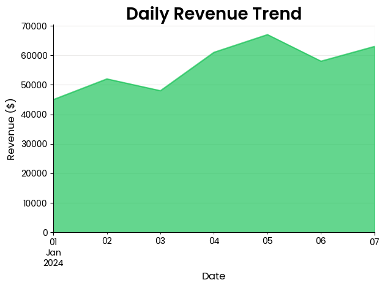
    

  </a>

  <a href="plots/bar/" class="glr-thumbcontainer">
    
Bar Plot

    

      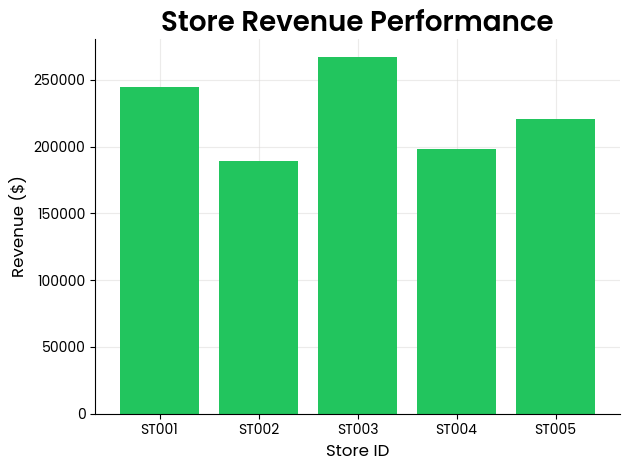
    

  </a>
  <a href="plots/broken_timeline/" class="glr-thumbcontainer">
    
Broken Timeline Plot

    

      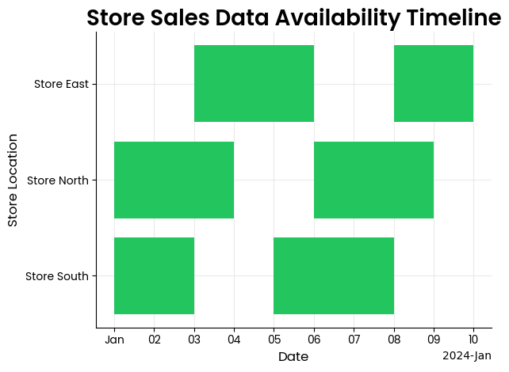
    

  </a>
  <a href="plots/cohort/" class="glr-thumbcontainer">
    
Cohort Plot

    

      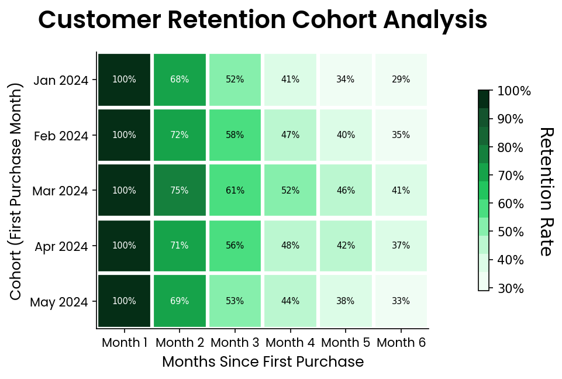
    

  </a>
  <a href="plots/heatmap/" class="glr-thumbcontainer">
    
Heatmap Plot

    

      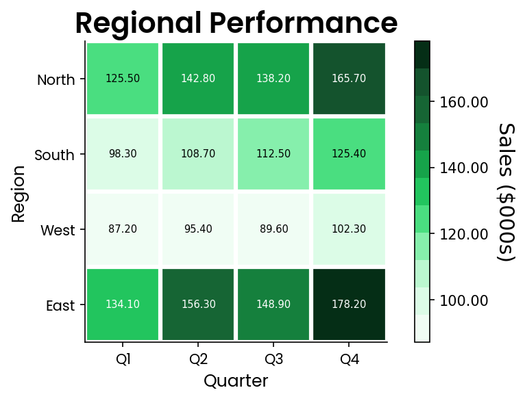
    

  </a>
  <a href="plots/histogram/" class="glr-thumbcontainer">
    
Histogram Plot

    

      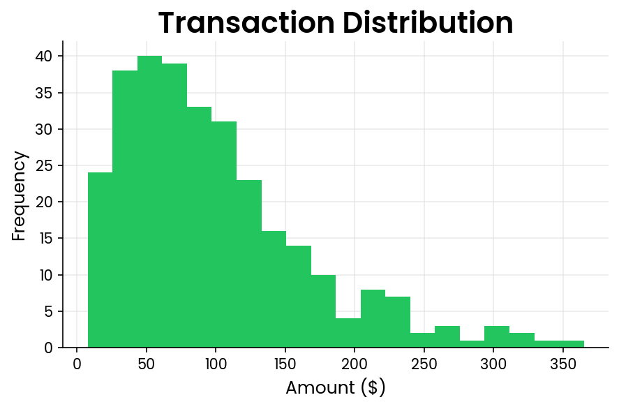
    

  </a>
  <a href="plots/line/" class="glr-thumbcontainer">
    
Line Plot

    

      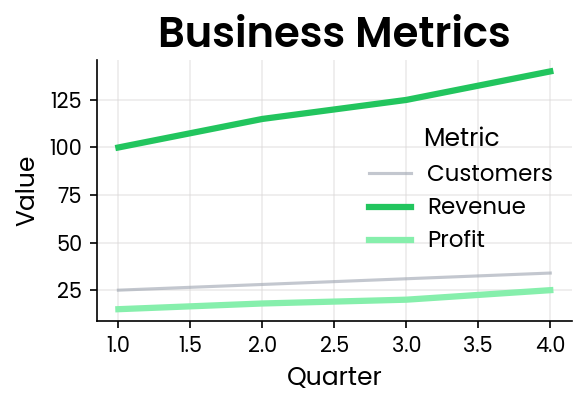
    

  </a>

  <a href="plots/period_on_period/" class="glr-thumbcontainer">
    
Period on Period Plot

    

      
    

    </a>

  <a href="plots/time/" class="glr-thumbcontainer">
    
Time Plot

    

      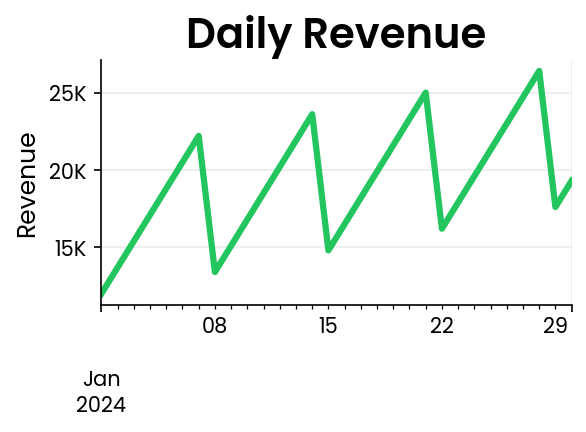
    

  </a>

  <a href="plots/venn/" class="glr-thumbcontainer">
    
Venn Diagram

    

      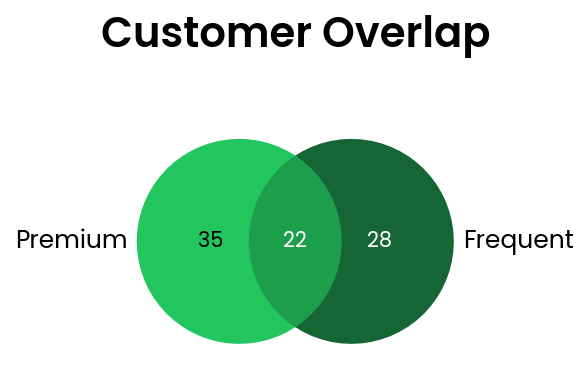
    

  </a>

  <a href="plots/waterfall/" class="glr-thumbcontainer">
    
Waterfall Plot

    

      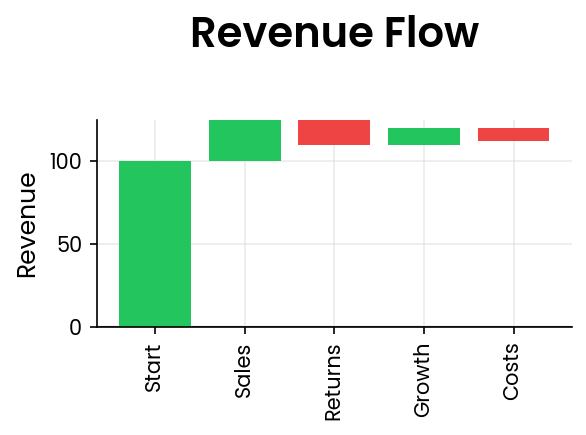
    

  </a>

  <a href="plots/index_plot/" class="glr-thumbcontainer">
    
Index Plot

    

      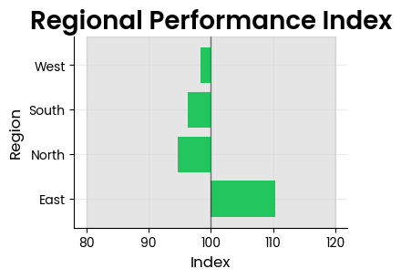
    

  </a>

  <a href="plots/scatter/" class="glr-thumbcontainer">
    
Scatter Plot

    

      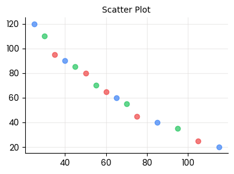
    

  </a>

  <a href="plots/price/" class="glr-thumbcontainer">
    
Price Plot

    

      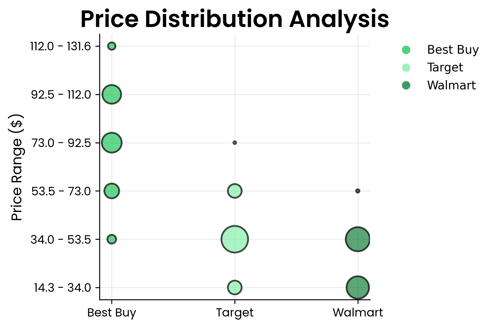
    

  </a>

